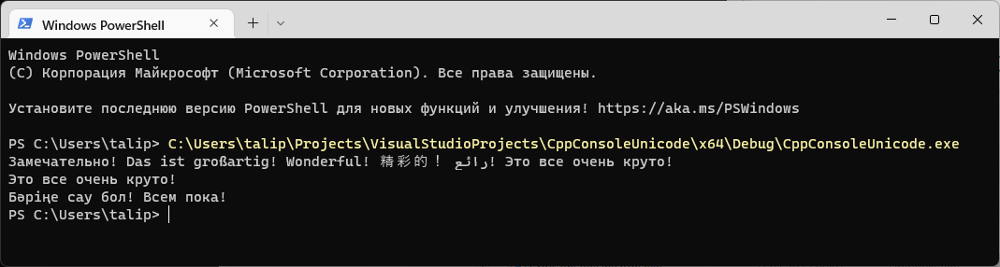

# CppConsoleUnicode
Пример консольной программы с UTF-8 на C++ для Windows



```
#include <iostream>
#include <stdio.h>
#include <stdlib.h>
#include <Windows.h>
#include <string>
using namespace std;


int main()
{
	SetConsoleCP(65001); // Принудительная установка консоли ввода на UTF-8
	SetConsoleOutputCP(65001); // Принудительная установка консоли вывода на UTF-8

	HANDLE out = GetStdHandle(STD_OUTPUT_HANDLE); // Получение указателя на вывод данных
	HANDLE in = GetStdHandle(STD_INPUT_HANDLE);  // Получение указателя на ввод данных

	// Наши строки
	static wstring myStr1 = L"Замечательно! Das ist großartig! Wonderful! 精彩的！ رائع! "; // Вариант объяывления 1
	static LPCWSTR myStr2 = L"Бәріңе сау бол! Всем пока!\n"; // Вариант объяывления 2
	static LPCWSTR newLine = L"\n"; // Переход на новую строку

	WriteConsoleW(out, myStr1.c_str(), myStr1.size(), NULL, NULL); // Вывод строки myStr1 на экран

	const size_t MAX_NUMBER_OF_CHARS = 128; // Максимальное количество символов в UTF-8, которые мы позволяем ввести
	wchar_t* str = (wchar_t*)calloc(MAX_NUMBER_OF_CHARS, sizeof(wchar_t)); // Выделяем память для вводимой строки

	unsigned long entered_number_of_chars; // Переменная для значения количества введенных символов

	// Чтение данных с консоли в кодировке UTF-8
	if (ReadConsoleW(in, str, MAX_NUMBER_OF_CHARS, &entered_number_of_chars, NULL) == 0) {
		printf("Error: %ld", GetLastError());
		return -1;
	}

	if (entered_number_of_chars > 0) entered_number_of_chars--; // Удаление перевода строки из ввода (-1 символ)

	if (entered_number_of_chars > 1) {
		WriteConsoleW(out, str, entered_number_of_chars, NULL, NULL); // Вывод на экран введенной строки
		WriteConsoleW(out, newLine, wcslen(newLine), NULL, NULL); // Переход на новую строку
	}

	WriteConsoleW(out, myStr2, wcslen(myStr2), NULL, NULL);  // Вывод строки myStr2 на экран

	// Освобождаем ресурсы
	CloseHandle(out);
	CloseHandle(in);
	free(str);

	return 0;
}
```
